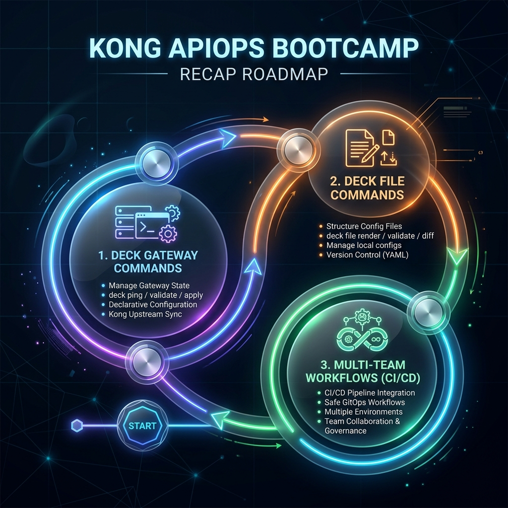

# Kong APIOps Bootcamp


> ⚙️ **Requires Kong Gateway 3.14 or newer** and decK 1.43+.

A hands-on bootcamp for learning decK - the CLI for declarative Kong configuration management. Continues from the API Gateway, AI Gateway, and Agentic bootcamps.



## Overview

| | |
|---|---|
| **Kong version** | **Kong Gateway 3.14+** |
| **Format** | 3 modules, 3 labs (~3.5 hours) |
| **Flow** | gateway commands → file commands → multi-team workflows |
| **Platform** | decK CLI + GitHub Actions → Kong Konnect |

## Modules

| # | Module | Key Topics |
|---|---|---|
| 01 | [deck gateway Commands](./module-01-deck-gateway/) | `ping`, `dump`, `diff`, `sync`, `apply`, `validate`, `reset` |
| 02 | [deck file Commands](./module-02-deck-file/) | `validate`, `lint`, `openapi2kong`, `merge`, `render`, `patch`, `add-plugins` |
| 03 | [Multi-Team Workflows](./module-03-deck-workflow/) | Tags, change workflows, OpenAPI-driven pipelines, backup/recovery |

## Prerequisites

- Completed [API Gateway Bootcamp](../api-gateway-bootcamp/) (or equivalent Kong experience)
- [Kong Gateway](https://developer.konghq.com/gateway/) or [Kong Konnect](https://cloud.konghq.com) with existing config
- [decK CLI](https://developer.konghq.com/deck/) installed (1.43+)
- [Node.js](https://nodejs.org/) 18+ (for docs site)
- jq 1.6+

## Getting Started

### Run the Docs Site Locally

```bash
npm install
npm run docs:dev
```

The docs site will be available at `http://localhost:5173`.

### Build for Production

```bash
npm run docs:build
npm run docs:preview
```

## Project Structure

```
apiops-bootcamp/
├── docs/                        # VitePress documentation source
│   └── .vitepress/              # VitePress config & theme
├── module-01-deck-gateway/
│   ├── README.md                # Module overview
│   └── labs/
│       └── 01-deck-gateway.md   # deck gateway commands
├── module-02-deck-file/
│   ├── README.md                # Module overview
│   └── labs/
│       └── 01-deck-file.md      # deck file commands
├── module-03-deck-workflow/
│   ├── README.md                # Module overview
│   └── labs/
│       └── 01-deck-workflow.md  # Multi-team workflows
├── index.md                     # Home page
└── package.json
```

## Stack

| Tool | Purpose |
|---|---|
| [Kong Gateway](https://developer.konghq.com/gateway/) | API gateway |
| [decK](https://developer.konghq.com/deck/) | Declarative Kong config management |
| [GitHub Actions](https://docs.github.com/en/actions) | CI/CD automation |
| [Kong Konnect](https://cloud.konghq.com) | Managed control plane |
| [VitePress](https://vitepress.dev/) | Documentation site |

## License

Private - for internal training use.
