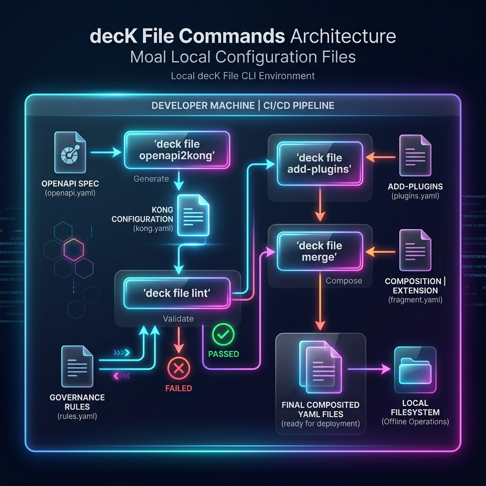

# Lab 02 - deck file commands

> **Story so far.** In Lab 01 you learned to capture, compare, and apply Kong state using `deck gateway` commands. You have a `kong-snapshot.yaml` from your running gateway.
>
> **This lab.** You'll learn the `deck file` command family - tools that manipulate Kong configuration files **without talking to Kong**. These run entirely offline: validate syntax, enforce rules, convert OpenAPI specs to Kong config, merge files, patch values, and manage plugins and tags.



---

## Before you start

Make sure you have `kong-snapshot.yaml` from Lab 01. If not, dump it now:

```bash
deck gateway dump --kong-addr http://localhost:8001 -o kong-snapshot.yaml
```

---

## Step 1 - deck file validate (10 min)

**What it does:** Checks your YAML against decK's built-in schema. Runs locally with no network - catches syntax errors, missing required fields, and broken entity references.

### Validate a correct file

```bash
deck file validate kong-snapshot.yaml
```

No output means valid. The exit code is `0`.

### Catch a syntax error

Create `broken.yaml`:

```yaml
_format_version: "3.0"
services:
  - name: bad-svc
    host: httpbin.konghq.com
    routes:
      - paths:
          - /broken
        # missing 'name' field
```

```bash
deck file validate broken.yaml
```

You'll see:

```
Error: 1 errors occurred:
  reading file broken.yaml: validating file content:
    services.0.routes.0: name is required
```

### Catch broken references

Create `orphan-plugin.yaml`:

```yaml
_format_version: "3.0"
plugins:
  - name: rate-limiting
    route: missing-route
    config:
      minute: 100
```

```bash
deck file validate orphan-plugin.yaml
```

decK detects the broken reference - `missing-route` doesn't exist in the file.

::: info file validate vs gateway validate
`deck file validate` is **fast** (no network) but only checks schemas and references within the file. It won't catch issues like invalid plugin configs for your specific Kong version. Use `deck gateway validate` for that.
:::

**✅ Checkpoint.** You can validate files locally and understand the error messages for missing fields and broken references.

---

## Step 2 - deck file lint (15 min)

**What it does:** Validates your config against custom governance rules defined in a ruleset file. Uses JSONPath selectors and built-in functions. Think of it as a policy engine for your YAML.

### Create a ruleset

Create `ruleset.yaml`:

```yaml
rules:
  https-only-services:
    description: "Services must use HTTPS"
    given: $.services[*].protocol
    severity: error
    then:
      function: pattern
      functionOptions:
        match: "^https$"

  routes-must-have-tags:
    description: "Every route must have at least one tag"
    given: $.services[*].routes[*]
    severity: warn
    then:
      field: tags
      function: defined

  no-wildcard-paths:
    description: "Routes should not use bare / as path"
    given: $.services[*].routes[*].paths[*]
    severity: error
    then:
      function: pattern
      functionOptions:
        notMatch: "^/$"
```

### Lint your snapshot

```bash
deck file lint -s kong-snapshot.yaml ruleset.yaml
```

You'll likely see violations - services from the API Gateway bootcamp used `http` protocol and routes probably don't have tags.

### Understand the output

```
Linting Violations: 3
Failures: 2

[error][12:15] Services must use HTTPS: `http` does not match the expression `^https$`
[warn][18:5] Every route must have at least one tag
[error][25:9] Routes should not use bare / as path: `/` does not match ...
```

Each violation shows:
- Severity (`error` / `warn`)
- Line and column in the file
- Rule description
- What failed

### Enforce in CI with exit codes

```bash
deck file lint -s kong-snapshot.yaml ruleset.yaml
echo "Exit code: $?"
# Non-zero if any "error" severity violations exist
```

The `--fail-severity` flag controls what triggers a non-zero exit:

```bash
# Fail on warnings too
deck file lint -s kong-snapshot.yaml ruleset.yaml --fail-severity warn

# Only fail on errors (default)
deck file lint -s kong-snapshot.yaml ruleset.yaml --fail-severity error
```

### Common lint patterns

| Rule | JSONPath | What it enforces |
|---|---|---|
| HTTPS only | `$.services[*].protocol` | No plaintext upstream traffic |
| Tags required | `$.services[*].routes[*]` → `tags` defined | Enables scoped operations |
| Select tags set | `$._info` → `select_tags` defined | Config file declares its scope |
| HTTPS routes only | `$.services[*].routes[*].protocols[0]` → pattern `^https$` | No plaintext client traffic |

::: tip Lint rules as governance
Teams use lint rules to enforce organizational standards: "all services must use HTTPS", "every entity must be tagged", "rate limiting must be present on every route". These rules run in CI before any config reaches Kong.
:::

**✅ Checkpoint.** You've written lint rules, run them against real config, and understand how to enforce governance policies offline.

---

## Step 3 - deck file openapi2kong (15 min)

**What it does:** Converts an OpenAPI specification into a Kong declarative configuration file. One command generates the Service, Routes (one per `operationId`), and optionally security plugins.

### Create a sample OpenAPI spec

Create `travel-api.yaml`:

```yaml
openapi: "3.0.3"
info:
  title: MyTravel API
  version: "1.0.0"
servers:
  - url: https://travel-api.internal:8443
paths:
  /flights:
    get:
      operationId: listFlights
      summary: List available flights
      parameters:
        - name: origin
          in: query
          schema:
            type: string
        - name: destination
          in: query
          schema:
            type: string
  /flights/{id}:
    get:
      operationId: getFlight
      summary: Get flight details
      parameters:
        - name: id
          in: path
          required: true
          schema:
            type: string
  /hotels:
    get:
      operationId: listHotels
      summary: Search hotels
  /bookings:
    post:
      operationId: createBooking
      summary: Create a booking
```

### Convert to Kong config

```bash
deck file openapi2kong \
  --spec travel-api.yaml \
  --output-file travel-kong.yaml
```

### Inspect the output

```bash
cat travel-kong.yaml
```

You'll see:
- A **Service** pointing to `travel-api.internal:8443`
- A **Route per operationId**: `listFlights`, `getFlight`, `listHotels`, `createBooking`
- Each route has the correct path and method

```yaml
_format_version: "3.0"
services:
  - name: mytravel-api
    host: travel-api.internal
    port: 8443
    protocol: https
    routes:
      - name: mytravel-api-listflights
        methods:
          - GET
        paths:
          - ~/flights$
      - name: mytravel-api-getflight
        methods:
          - GET
        paths:
          - ~/flights/(?<id>[^/]+)$
    # ...
```

### Useful flags

```bash
# Add tags to all generated entities
deck file openapi2kong --spec travel-api.yaml \
  --select-tag team-travel,env-dev \
  -o travel-kong.yaml

# Skip ID generation (if you want name-based matching)
deck file openapi2kong --spec travel-api.yaml \
  --inso-compatible \
  -o travel-kong.yaml
```

::: info Best practice: don't embed plugins in the spec
While `openapi2kong` supports `x-kong-plugin-*` extensions to add plugins, it's better to keep plugin config separate. Use `deck file add-plugins` after conversion to layer plugins independently - routing and policy ownership are usually separate concerns.
:::

**✅ Checkpoint.** You've converted an OpenAPI spec to Kong config and understand the mapping: servers → Service, operationId → Route.

---

## Step 4 - deck file merge and render (10 min)

**What it does:**
- `deck file merge` - Concatenates multiple partial files into one, preserving environment variables unexpanded.
- `deck file render` - Combines complete files, resolves environment variables, validates schema, and warns about duplicates.

### Merge partial files

Create two partial files:

`services-part.yaml`:
```yaml
_format_version: "3.0"
services:
  - name: flights-svc
    host: httpbin.konghq.com
    port: 443
    protocol: https
```

`consumers-part.yaml`:
```yaml
_format_version: "3.0"
consumers:
  - username: web-app
    custom_id: web-001
```

Merge them:

```bash
deck file merge services-part.yaml consumers-part.yaml \
  -o combined.yaml
```

```bash
cat combined.yaml
# Both services and consumers are in one file
```

### Render with environment variables

Create `env-config.yaml`:

```yaml
_format_version: "3.0"
services:
  - name: flights-svc
    host: ${{ env "DECK_FLIGHTS_HOST" }}
    port: 443
    protocol: https
```

```bash
# Without populating env vars (mocked values)
deck file render env-config.yaml

# With actual env var values
export DECK_FLIGHTS_HOST="httpbin.konghq.com"
deck file render env-config.yaml --populate-env-vars
```

::: info merge vs render
| | `deck file merge` | `deck file render` |
|---|---|---|
| Input | Partial or complete files | Complete files only |
| Env vars | Preserved as-is | Mocked or resolved |
| Validation | None | Schema validation + duplicate detection |
| Use case | Build pipeline composition | Pre-sync inspection |
:::

**✅ Checkpoint.** You can combine files with `merge` and preview the final rendered output with `render`.

---

## Step 5 - deck file patch (10 min)

**What it does:** Updates values in a Kong declarative config file using JSONPath selectors. Useful for programmatic modifications without manually editing YAML.

### Patch a service host

```bash
deck file patch \
  -s kong-snapshot.yaml \
  --selector '$.services[?(@.name=="flights-svc")]' \
  --value 'host:httpbin.org' \
  -o patched.yaml
```

Check the result:

```bash
grep -A3 "flights-svc" patched.yaml
```

### Patch multiple values

```bash
# Change protocol and port together
deck file patch \
  -s kong-snapshot.yaml \
  --selector '$.services[?(@.name=="flights-svc")]' \
  --value 'protocol:http' \
  --value 'port:80' \
  -o patched.yaml
```

::: tip When to patch vs manually edit
Use `deck file patch` in pipelines where you need to programmatically adjust config between environments - change hosts, toggle features, or inject environment-specific values.
:::

**✅ Checkpoint.** You can modify config values programmatically using JSONPath selectors.

---

## Step 6 - deck file add-plugins (10 min)

**What it does:** Adds plugin configurations to a Kong declarative config file. You can target specific services or routes using selectors.

### Add rate limiting to a service

```bash
deck file add-plugins \
  -s kong-snapshot.yaml \
  --selector '$.services[?(@.name=="flights-svc")]' \
  --config '{"name":"rate-limiting","config":{"minute":60,"policy":"local"}}' \
  -o with-rate-limit.yaml
```

### Add a global plugin

```bash
deck file add-plugins \
  -s kong-snapshot.yaml \
  --config '{"name":"correlation-id","config":{"header_name":"X-Request-ID","generator":"uuid#counter","echo_downstream":true}}' \
  -o with-correlation.yaml
```

### Pipeline pattern: OpenAPI → add plugins → validate

This is a common pattern in federated teams:

```bash
# 1. API team generates config from their spec
deck file openapi2kong --spec travel-api.yaml -o travel-base.yaml

# 2. Platform team adds standard plugins
deck file add-plugins -s travel-base.yaml \
  --config '{"name":"rate-limiting","config":{"minute":100,"policy":"local"}}' \
  -o travel-with-policy.yaml

# 3. Validate the final config
deck file validate travel-with-policy.yaml
```

**✅ Checkpoint.** You can add plugins to config files without manual editing, and understand the pipeline pattern.

---

## Step 7 - deck file tags (10 min)

**What it does:** The tag commands let you add, list, and remove tags from entities in a config file. Tags are how decK scopes operations - they're critical for multi-team environments.

### List existing tags

```bash
deck file list-tags -s kong-snapshot.yaml
```

### Add tags to all entities

```bash
deck file add-tags -s kong-snapshot.yaml \
  --tag team-platform \
  --tag env-dev \
  -o tagged.yaml
```

Verify:

```bash
deck file list-tags -s tagged.yaml
```

### Remove tags

```bash
deck file remove-tags -s tagged.yaml \
  --tag env-dev \
  -o untagged.yaml
```

### Why tags matter

Tags unlock `--select-tag` on gateway commands:

```bash
# Only sync entities tagged "team-travel"
deck gateway sync --kong-addr http://localhost:8001 \
  --select-tag team-travel \
  travel-config.yaml

# Only diff entities tagged "team-platform"
deck gateway diff --kong-addr http://localhost:8001 \
  --select-tag team-platform \
  platform-config.yaml
```

This means multiple teams can manage their own config files and deploy independently without stepping on each other.

::: tip Tags = ownership boundaries
In a multi-team setup: each team tags their entities. `--select-tag` ensures `deck gateway sync` only touches entities that belong to that team. No team can accidentally delete another team's config.
:::

**✅ Checkpoint.** You can manage tags on config files and understand how tags enable scoped gateway operations.

---

## Command summary

| Command | Does what | Needs Kong? |
|---|---|---|
| `deck file validate` | Schema and reference checks | No |
| `deck file lint` | Custom governance rules | No |
| `deck file openapi2kong` | OpenAPI → Kong config | No |
| `deck file merge` | Combine partial files | No |
| `deck file render` | Combine + resolve env vars + validate | No |
| `deck file patch` | Modify values with JSONPath | No |
| `deck file add-plugins` | Add plugins to config | No |
| `deck file add-tags` | Tag entities for scoping | No |
| `deck file list-tags` | Show all tags in a file | No |
| `deck file remove-tags` | Remove tags from entities | No |

## What you learned

1. **validate** catches errors before they reach Kong - run it on every change
2. **lint** enforces team standards via rulesets - automate in CI
3. **openapi2kong** bridges API design and gateway config
4. **merge/render** compose multi-file configs into a single deployable state
5. **patch/add-plugins** enable programmatic config manipulation in pipelines
6. **tags** are the mechanism for multi-team ownership and scoped operations

---

*Lab 02 complete. Next: [Lab 03 - Putting it all together →](/module-01-apiops/labs/03-deck-workflow)*
