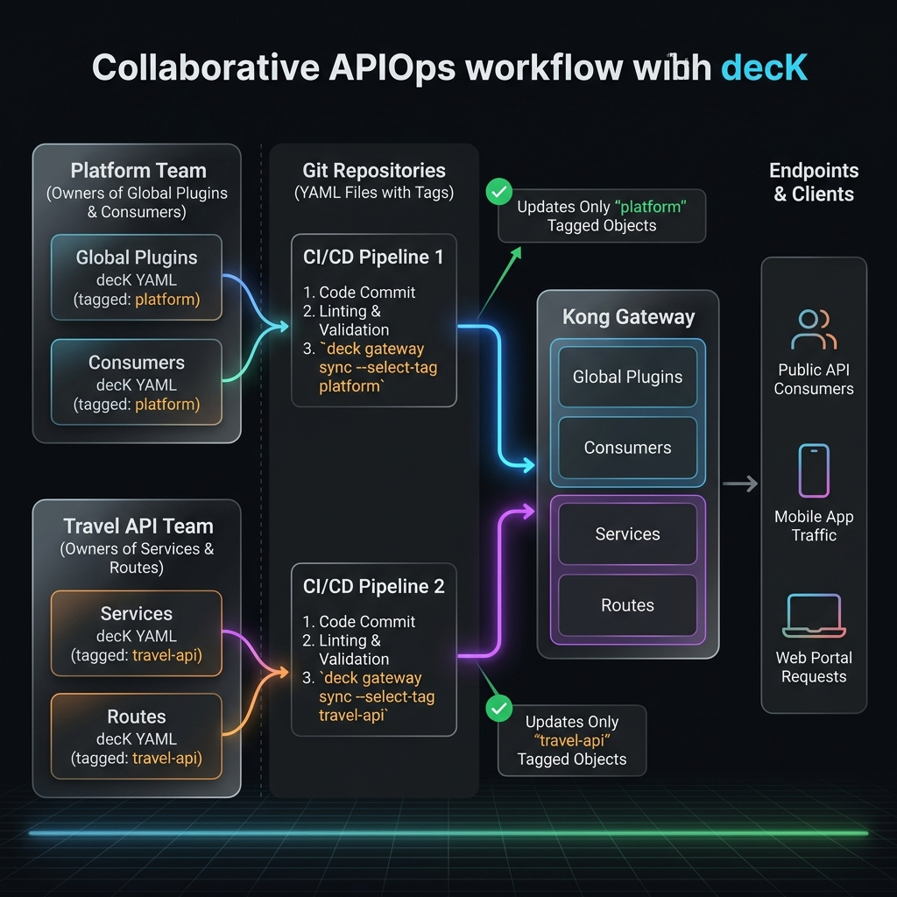

# Lab 03 - Putting it all together

> **Story so far.** You know the individual `deck gateway` and `deck file` commands. Now you'll use them together in a realistic workflow: a platform team and an API team collaborating on the same Kong instance, each owning their slice of configuration.
>
> **Scenario.** Your organization has two teams:
> - **Platform team** owns global plugins (CORS, correlation-id, rate limiting defaults) and consumers
> - **Bookstore API team** owns the `bookstore-service`, `inventory-service`, and `payments-service` services and routes from the API Gateway bootcamp
>
> Both teams need to work independently without breaking each other's config. You'll set this up using decK tags and the commands you've learned.



---

## Step 1 - Snapshot and split (15 min)

Start by capturing the current state and splitting it into team-owned files.

### Dump the current state

```bash
deck gateway dump --kong-addr http://localhost:8001 -o full-state.yaml
```

Or with Konnect:

```bash
deck gateway dump \
  --konnect-token "$KONNECT_TOKEN" \
  --konnect-control-plane-name default \
  -o full-state.yaml
```

### Split into team files

Create `platform/global.yaml` with just the global plugins and consumers:

```yaml
_format_version: "3.0"
_info:
  select_tags:
    - team-platform
consumers:
  - username: web-app
    custom_id: web-001
    tags:
      - team-platform
    keyauth_credentials:
      - key: web-app-secret-key-001
  - username: mobile-app
    custom_id: mobile-001
    tags:
      - team-platform
    keyauth_credentials:
      - key: mobile-app-secret-key-002
plugins:
  - name: correlation-id
    config:
      header_name: X-Request-ID
      generator: uuid#counter
      echo_downstream: true
    tags:
      - team-platform
```

Create `travel/services.yaml` with the travel team's services:

```yaml
_format_version: "3.0"
_info:
  select_tags:
    - team-bookstore
services:
  - name: bookstore-service
    host: httpbun.com
    port: 443
    protocol: https
    tags:
      - team-bookstore
    routes:
      - name: bookstore-route
        paths:
          - /bookstore
        strip_path: true
        tags:
          - team-bookstore
    plugins:
      - name: key-auth
        config:
          key_names:
            - X-API-Key
        tags:
          - team-bookstore
  - name: inventory-service
    host: httpbun.com
    port: 443
    protocol: https
    tags:
      - team-bookstore
    routes:
      - name: hotels-route
        paths:
          - /hotels
        strip_path: true
        tags:
          - team-bookstore
```

**✅ Checkpoint.** You have two separate config files, each tagged with its team name.

---

## Step 2 - Independent team operations (15 min)

Now each team can work independently.

### Platform team validates and syncs

```bash
# Validate locally
deck file validate platform/global.yaml

# Check what would change (scoped to team-platform tags)
deck gateway diff --kong-addr http://localhost:8001 \
  --select-tag team-platform \
  platform/global.yaml

# Apply only platform-owned entities
deck gateway sync --kong-addr http://localhost:8001 \
  --select-tag team-platform \
  platform/global.yaml
```

Or with Konnect:

```bash
# Check what would change (scoped to team-platform tags)
deck gateway diff \
  --konnect-token "$KONNECT_TOKEN" \
  --konnect-control-plane-name default \
  --select-tag team-platform \
  platform/global.yaml

# Apply only platform-owned entities
deck gateway sync \
  --konnect-token "$KONNECT_TOKEN" \
  --konnect-control-plane-name default \
  --select-tag team-platform \
  platform/global.yaml
```

### Travel team validates and syncs

```bash
# Validate
deck file validate travel/services.yaml

# Preview
deck gateway diff --kong-addr http://localhost:8001 \
  --select-tag team-bookstore \
  travel/services.yaml

# Apply only travel-owned entities
deck gateway sync --kong-addr http://localhost:8001 \
  --select-tag team-bookstore \
  travel/services.yaml
```

Or with Konnect:

```bash
# Preview
deck gateway diff \
  --konnect-token "$KONNECT_TOKEN" \
  --konnect-control-plane-name default \
  --select-tag team-bookstore \
  travel/services.yaml

# Apply only travel-owned entities
deck gateway sync \
  --konnect-token "$KONNECT_TOKEN" \
  --konnect-control-plane-name default \
  --select-tag team-bookstore \
  travel/services.yaml
```

### Verify independence

```bash
# Both teams' entities coexist
curl -s http://localhost:8001/services | jq '.data[].name'
# bookstore-service, inventory-service (team-bookstore)
# ...plus any other services (untagged or other teams)

# Platform global plugin is active
curl -sI http://localhost:8000/bookstore \
  -H "X-API-Key: web-app-secret-key-001" | grep X-Request-ID
```

::: tip select-tag safety
When you use `--select-tag team-bookstore`, `deck gateway sync` only creates/updates/deletes entities with the `team-bookstore` tag. The platform team's entities are invisible and untouched.
:::

**✅ Checkpoint.** Two teams can sync independently. Neither team can delete the other team's entities.

---

## Step 3 - Change workflow (15 min)

Walk through a realistic change: the travel team adds a new service for car rentals.

### 1. Edit the config file

Add to `travel/services.yaml`:

```yaml
  - name: payments-service
    host: httpbun.com
    port: 443
    protocol: https
    tags:
      - team-bookstore
    routes:
      - name: cars-route
        paths:
          - /cars
        strip_path: true
        tags:
          - team-bookstore
    plugins:
      - name: rate-limiting
        config:
          minute: 30
          policy: local
        tags:
          - team-bookstore
```

### 2. Validate

```bash
deck file validate travel/services.yaml
```

### 3. Lint against team standards

Create `travel/ruleset.yaml`:

```yaml
rules:
  must-have-rate-limiting:
    description: "Every service must have a rate-limiting plugin"
    given: $.services[*].plugins[*]
    severity: warn
    then:
      field: name
      function: pattern
      functionOptions:
        match: "rate-limiting"

  https-upstream:
    description: "Upstream connections must use HTTPS"
    given: $.services[*].protocol
    severity: error
    then:
      function: pattern
      functionOptions:
        match: "^https$"
```

```bash
deck file lint -s travel/services.yaml travel/ruleset.yaml
```

### 4. Preview the diff

```bash
deck gateway diff --kong-addr http://localhost:8001 \
  --select-tag team-bookstore \
  travel/services.yaml
```

Or with Konnect:

```bash
deck gateway diff \
  --konnect-token "$KONNECT_TOKEN" \
  --konnect-control-plane-name default \
  --select-tag team-bookstore \
  travel/services.yaml
```

Expected output:

```
creating service payments-service
creating route cars-route
creating plugin rate-limiting (service: payments-service)

Summary:
  Created: 3
  Updated: 0
  Deleted: 0
```

### 5. Apply

```bash
deck gateway sync --kong-addr http://localhost:8001 \
  --select-tag team-bookstore \
  travel/services.yaml
```

Or with Konnect:

```bash
deck gateway sync \
  --konnect-token "$KONNECT_TOKEN" \
  --konnect-control-plane-name default \
  --select-tag team-bookstore \
  travel/services.yaml
```

### 6. Verify

```bash
curl -s http://localhost:8000/cars | head -5
```

**✅ Checkpoint.** You've completed a full change workflow: edit → validate → lint → diff → sync → verify.

---

## Step 4 - OpenAPI-driven workflow (15 min)

Now try a workflow where config starts from an OpenAPI spec instead of hand-written YAML.

### 1. Start from a spec

Use the `bookstore-api.yaml` OpenAPI spec from Lab 02 (or create a new one).

### 2. Convert

```bash
deck file openapi2kong \
  --spec bookstore-api.yaml \
  --select-tag team-bookstore \
  -o travel-from-oas.yaml
```

### 3. Layer in plugins

```bash
deck file add-plugins \
  -s travel-from-oas.yaml \
  --config '{"name":"rate-limiting","config":{"minute":100,"policy":"local"},"tags":["team-bookstore"]}' \
  -o travel-with-plugins.yaml
```

### 4. Validate and preview

```bash
deck file validate travel-with-plugins.yaml

deck gateway diff --kong-addr http://localhost:8001 \
  --select-tag team-bookstore \
  travel-with-plugins.yaml
```

Or with Konnect:

```bash
deck gateway diff \
  --konnect-token "$KONNECT_TOKEN" \
  --konnect-control-plane-name default \
  --select-tag team-bookstore \
  travel-with-plugins.yaml
```

### 5. Render the final state

```bash
deck file render travel-with-plugins.yaml
```

Review the rendered output - this is exactly what will be sent to Kong.

**✅ Checkpoint.** You've gone from OpenAPI spec to deployable Kong config using only decK commands.

---

## Step 5 - Backup and recovery (10 min)

### Take a team-scoped backup

```bash
# Dump only your team's entities
deck gateway dump --kong-addr http://localhost:8001 \
  --select-tag team-bookstore \
  -o travel-backup-$(date +%Y%m%d).yaml
```

Or with Konnect:

```bash
deck gateway dump \
  --konnect-token "$KONNECT_TOKEN" \
  --konnect-control-plane-name default \
  --select-tag team-bookstore \
  -o travel-backup-$(date +%Y%m%d).yaml
```

### Simulate a disaster

```bash
# Delete only travel team entities
deck gateway reset --kong-addr http://localhost:8001 \
  --select-tag team-bookstore
```

Or with Konnect:

```bash
deck gateway reset \
  --konnect-token "$KONNECT_TOKEN" \
  --konnect-control-plane-name default \
  --select-tag team-bookstore
```

Verify they're gone:

```bash
curl -s http://localhost:8001/services/bookstore-service
# 404
```

But platform entities are untouched:

```bash
curl -s http://localhost:8001/consumers | jq '.data[].username'
# web-app, mobile-app (still there)
```

### Restore

```bash
deck gateway sync --kong-addr http://localhost:8001 \
  --select-tag team-bookstore \
  travel-backup-*.yaml
```

Or with Konnect:

```bash
deck gateway sync \
  --konnect-token "$KONNECT_TOKEN" \
  --konnect-control-plane-name default \
  --select-tag team-bookstore \
  travel-backup-*.yaml
```

```bash
curl -s http://localhost:8001/services | jq '.data[].name'
# bookstore-service, inventory-service, payments-service - restored
```

**✅ Checkpoint.** You can take scoped backups and restore individual team configs without affecting others.

---

## Full decK command reference

### deck gateway (requires running Kong)

| Command | Purpose |
|---|---|
| `deck gateway ping` | Test connectivity |
| `deck gateway dump` | Export live config to file |
| `deck gateway diff` | Preview changes (read-only) |
| `deck gateway sync` | Full reconciliation (creates, updates, **deletes**) |
| `deck gateway apply` | Additive only (creates, updates, no deletes) |
| `deck gateway validate` | Validate against live Admin API |
| `deck gateway reset` | Delete all (or tagged) entities |

### deck file (offline, no Kong needed)

| Command | Purpose |
|---|---|
| `deck file validate` | Check YAML syntax and references |
| `deck file lint` | Enforce governance rules |
| `deck file openapi2kong` | Convert OpenAPI spec to Kong config |
| `deck file merge` | Combine partial files |
| `deck file render` | Combine, resolve env vars, validate |
| `deck file patch` | Modify values with JSONPath |
| `deck file add-plugins` | Add plugin configs to file |
| `deck file add-tags` | Tag entities |
| `deck file list-tags` | List tags in file |
| `deck file remove-tags` | Remove tags from entities |

### Essential flags

| Flag | Works with | What it does |
|---|---|---|
| `--select-tag` | diff, sync, dump, reset | Scope to tagged entities only |
| `--skip-consumers` | diff, sync, dump | Exclude consumers from operation |
| `--json-output` | diff, sync | Machine-readable output |
| `--parallelism N` | diff, sync, apply | Concurrent operations |
| `--non-zero-exit-code` | diff | Exit code 2 when diff exists |
| `--sanitize` | dump | Hash sensitive values for safe sharing |

## What you learned

1. **Tags are the foundation** of multi-team decK workflows - they define ownership boundaries
2. The **standard change workflow** is: edit → validate → lint → diff → sync → verify
3. **OpenAPI-driven workflows** use `openapi2kong` → `add-plugins` → validate → sync
4. **Scoped backups** with `--select-tag` let you backup and restore independently
5. All `deck file` commands run **offline** - use them in CI before any gateway interaction

---

*Lab 03 complete. [← Back to Module Overview](/module-01-apiops/)*
